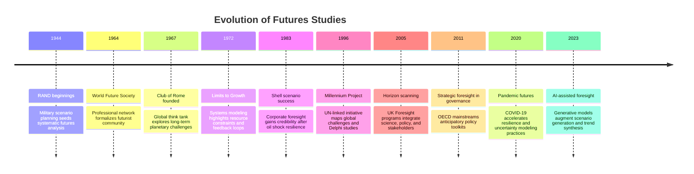

```mermaid
timeline
    title Evolution of Futures Studies
    1944 : RAND beginnings
          : Military scenario planning seeds systematic futures analysis
    1964 : World Future Society
          : Professional network formalizes futurist community
    1967 : Club of Rome founded
          : Global think tank explores long-term planetary challenges
    1972 : Limits to Growth
          : Systems modeling highlights resource constraints and feedback loops
    1983 : Shell scenario success
          : Corporate foresight gains credibility after oil shock resilience
    1996 : Millennium Project
          : UN-linked initiative maps global challenges and Delphi studies
    2005 : Horizon scanning
          : UK Foresight programs integrate science, policy, and stakeholders
    2011 : Strategic foresight in governance
          : OECD mainstreams anticipatory policy toolkits
    2020 : Pandemic futures
          : COVID-19 accelerates resilience and uncertainty modeling practices
    2023 : AI-assisted foresight
          : Generative models augment scenario generation and trend synthesis
```
