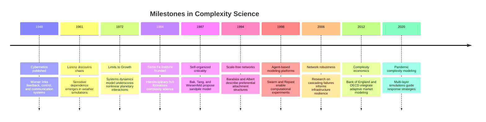

```mermaid
timeline
    title Milestones in Complexity Science
    1948 : Cybernetics published
          : Wiener links feedback, control, and communication systems
    1961 : Lorenz discovers chaos
          : Sensitive dependence emerges in weather simulations
    1972 : Limits to Growth
          : Systems dynamics model underscores nonlinear planetary interactions
    1984 : Santa Fe Institute founded
          : Interdisciplinary hub formalizes complexity science
    1987 : Self-organized criticality
          : Bak, Tang, and Wiesenfeld propose sandpile model
    1994 : Scale-free networks
          : Barabási and Albert describe preferential attachment structures
    1998 : Agent-based modeling platforms
          : Swarm and Repast enable computational experiments
    2006 : Network robustness
          : Research on cascading failures informs infrastructure resilience
    2012 : Complexity economics
          : Bank of England and OECD integrate adaptive market modeling
    2020 : Pandemic complexity modeling
          : Multi-layer simulations guide response strategies
```
