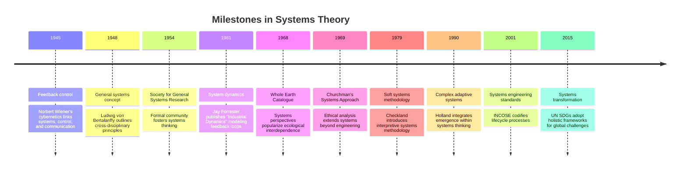

```mermaid
timeline
    title Milestones in Systems Theory
    1945 : Feedback control
          : Norbert Wiener's cybernetics links systems, control, and communication
    1948 : General systems concept
          : Ludwig von Bertalanffy outlines cross-disciplinary principles
    1954 : Society for General Systems Research
          : Formal community fosters systems thinking
    1961 : System dynamics
          : Jay Forrester publishes "Industrial Dynamics" modeling feedback loops
    1968 : Whole Earth Catalogue
          : Systems perspectives popularize ecological interdependence
    1969 : Churchman's Systems Approach
          : Ethical analysis extends systems beyond engineering
    1979 : Soft systems methodology
          : Checkland introduces interpretive systems methodology
    1990 : Complex adaptive systems
          : Holland integrates emergence within systems thinking
    2001 : Systems engineering standards
          : INCOSE codifies lifecycle processes
    2015 : Systems transformation
          : UN SDGs adopt holistic frameworks for global challenges
```
