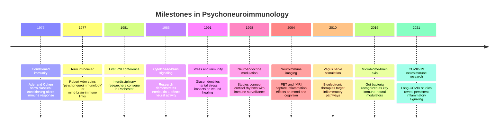

```mermaid
timeline
    title Milestones in Psychoneuroimmunology
    1975 : Conditioned immunity
          : Ader and Cohen show classical conditioning alters immune response
    1977 : Term introduced
          : Robert Ader coins "psychoneuroimmunology" for mind-brain-immune links
    1981 : First PNI conference
          : Interdisciplinary researchers convene in Rochester
    1985 : Cytokine-to-brain signaling
          : Research demonstrates interleukin-1 affects neural activity
    1991 : Stress and immunity
          : Glaser identifies marital stress impacts on wound healing
    1998 : Neuroendocrine modulation
          : Studies connect cortisol rhythms with immune surveillance
    2004 : Neuroimmune imaging
          : PET and fMRI capture inflammation effects on mood and cognition
    2010 : Vagus nerve stimulation
          : Bioelectronic therapies target inflammatory pathways
    2016 : Microbiome-brain axis
          : Gut bacteria recognized as key immune-neural modulators
    2021 : COVID-19 neuroimmune research
          : Long-COVID studies reveal persistent inflammatory signaling
```
