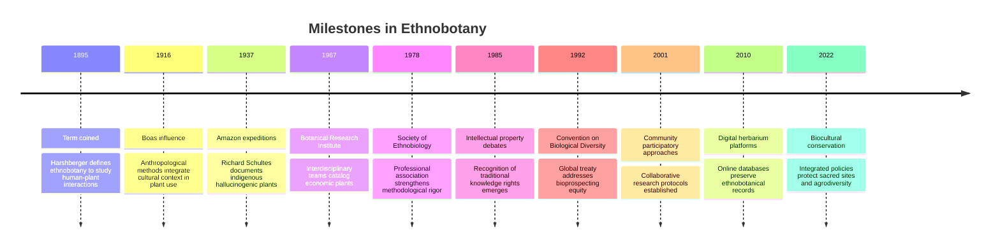

```mermaid
timeline
    title Milestones in Ethnobotany
    1895 : Term coined
          : Harshberger defines ethnobotany to study human-plant interactions
    1916 : Boas influence
          : Anthropological methods integrate cultural context in plant use
    1937 : Amazon expeditions
          : Richard Schultes documents indigenous hallucinogenic plants
    1967 : Botanical Research Institute
          : Interdisciplinary teams catalog economic plants
    1978 : Society of Ethnobiology
          : Professional association strengthens methodological rigor
    1985 : Intellectual property debates
          : Recognition of traditional knowledge rights emerges
    1992 : Convention on Biological Diversity
          : Global treaty addresses bioprospecting equity
    2001 : Community participatory approaches
          : Collaborative research protocols established
    2010 : Digital herbarium platforms
          : Online databases preserve ethnobotanical records
    2022 : Biocultural conservation
          : Integrated policies protect sacred sites and agrodiversity
```
