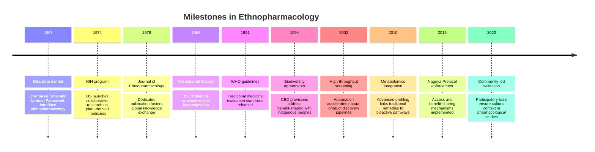

```mermaid
timeline
    title Milestones in Ethnopharmacology
    1967 : Discipline named
          : Étienne de Smet and Norman Farnsworth introduce ethnopharmacology
    1974 : NIH program
          : US launches collaborative research on plant-derived medicines
    1978 : Journal of Ethnopharmacology
          : Dedicated publication fosters global knowledge exchange
    1984 : International Society
          : ISE formed to advance ethical bioprospecting
    1991 : WHO guidelines
          : Traditional medicine evaluation standards released
    1994 : Biodiversity agreements
          : CBD provisions address benefit-sharing with indigenous peoples
    2002 : High-throughput screening
          : Automation accelerates natural product discovery pipelines
    2010 : Metabolomics integration
          : Advanced profiling links traditional remedies to bioactive pathways
    2015 : Nagoya Protocol enforcement
          : Access and benefit-sharing mechanisms implemented
    2023 : Community-led validation
          : Participatory trials ensure cultural context in pharmacological studies
```
