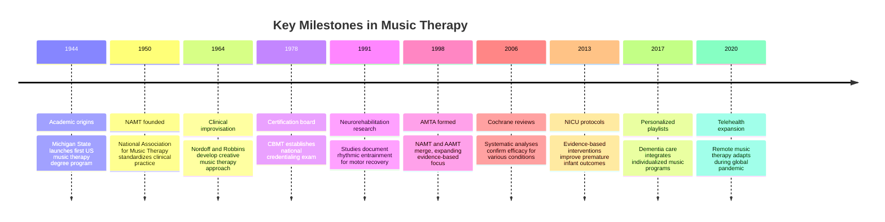

```mermaid
timeline
    title Key Milestones in Music Therapy
    1944 : Academic origins
          : Michigan State launches first US music therapy degree program
    1950 : NAMT founded
          : National Association for Music Therapy standardizes clinical practice
    1964 : Clinical improvisation
          : Nordoff and Robbins develop creative music therapy approach
    1978 : Certification board
          : CBMT establishes national credentialing exam
    1991 : Neurorehabilitation research
          : Studies document rhythmic entrainment for motor recovery
    1998 : AMTA formed
          : NAMT and AAMT merge, expanding evidence-based focus
    2006 : Cochrane reviews
          : Systematic analyses confirm efficacy for various conditions
    2013 : NICU protocols
          : Evidence-based interventions improve premature infant outcomes
    2017 : Personalized playlists
          : Dementia care integrates individualized music programs
    2020 : Telehealth expansion
          : Remote music therapy adapts during global pandemic
```
