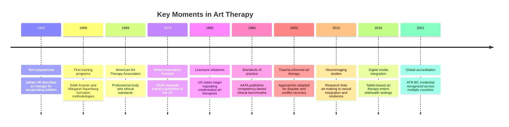

```mermaid
timeline
    title Key Moments in Art Therapy
    1942 : Term popularized
          : Adrian Hill describes art therapy for recuperating soldiers
    1958 : First training programs
          : Edith Kramer and Margaret Naumburg formalize methodologies
    1969 : American Art Therapy Association
          : Professional body sets ethical standards
    1974 : British Association founded
          : BAAT expands practice guidelines in the UK
    1982 : Licensure initiatives
          : US states begin regulating credentialed art therapists
    1994 : Standards of practice
          : AATA publishes competency-based clinical benchmarks
    2003 : Trauma-informed art therapy
          : Approaches adopted for disaster and conflict recovery
    2010 : Neuroimaging studies
          : Research links art-making to neural integration and resilience
    2016 : Digital media integration
          : Tablet-based art therapy enters telehealth settings
    2021 : Global accreditation
          : ATR-BC credential recognized across multiple countries
```
