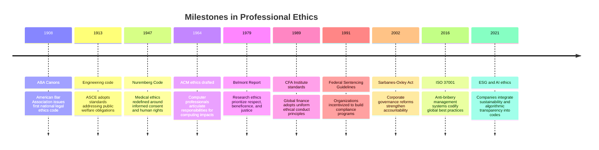

```mermaid
timeline
    title Milestones in Professional Ethics
    1908 : ABA Canons
          : American Bar Association issues first national legal ethics code
    1913 : Engineering code
          : ASCE adopts standards addressing public welfare obligations
    1947 : Nuremberg Code
          : Medical ethics redefined around informed consent and human rights
    1964 : ACM ethics drafted
          : Computer professionals articulate responsibilities for computing impacts
    1979 : Belmont Report
          : Research ethics prioritize respect, beneficence, and justice
    1989 : CFA Institute standards
          : Global finance adopts uniform ethical conduct principles
    1991 : Federal Sentencing Guidelines
          : Organizations incentivized to build compliance programs
    2002 : Sarbanes-Oxley Act
          : Corporate governance reforms strengthen accountability
    2016 : ISO 37001
          : Anti-bribery management systems codify global best practices
    2021 : ESG and AI ethics
          : Companies integrate sustainability and algorithmic transparency into codes
```
