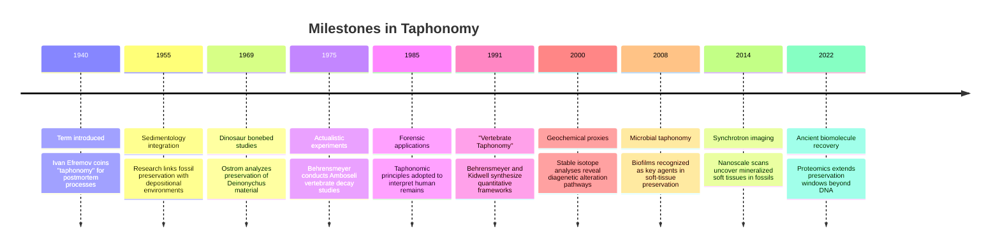

```mermaid
timeline
    title Milestones in Taphonomy
    1940 : Term introduced
          : Ivan Efremov coins "taphonomy" for postmortem processes
    1955 : Sedimentology integration
          : Research links fossil preservation with depositional environments
    1969 : Dinosaur bonebed studies
          : Ostrom analyzes preservation of Deinonychus material
    1975 : Actualistic experiments
          : Behrensmeyer conducts Amboseli vertebrate decay studies
    1985 : Forensic applications
          : Taphonomic principles adopted to interpret human remains
    1991 : "Vertebrate Taphonomy"
          : Behrensmeyer and Kidwell synthesize quantitative frameworks
    2000 : Geochemical proxies
          : Stable isotope analyses reveal diagenetic alteration pathways
    2008 : Microbial taphonomy
          : Biofilms recognized as key agents in soft-tissue preservation
    2014 : Synchrotron imaging
          : Nanoscale scans uncover mineralized soft tissues in fossils
    2022 : Ancient biomolecule recovery
          : Proteomics extends preservation windows beyond DNA
```
