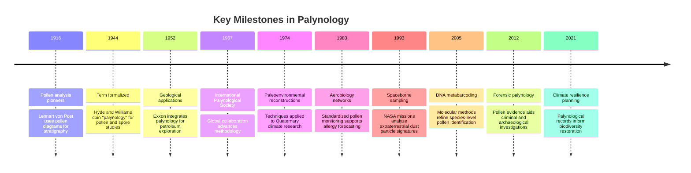

```mermaid
timeline
    title Key Milestones in Palynology
    1916 : Pollen analysis pioneers
          : Lennart von Post uses pollen diagrams for stratigraphy
    1944 : Term formalized
          : Hyde and Williams coin "palynology" for pollen and spore studies
    1952 : Geological applications
          : Exxon integrates palynology for petroleum exploration
    1967 : International Palynological Society
          : Global collaboration advances methodology
    1974 : Paleoenvironmental reconstructions
          : Techniques applied to Quaternary climate research
    1983 : Aerobiology networks
          : Standardized pollen monitoring supports allergy forecasting
    1993 : Spaceborne sampling
          : NASA missions analyze extraterrestrial dust particle signatures
    2005 : DNA metabarcoding
          : Molecular methods refine species-level pollen identification
    2012 : Forensic palynology
          : Pollen evidence aids criminal and archaeological investigations
    2021 : Climate resilience planning
          : Palynological records inform biodiversity restoration
```
