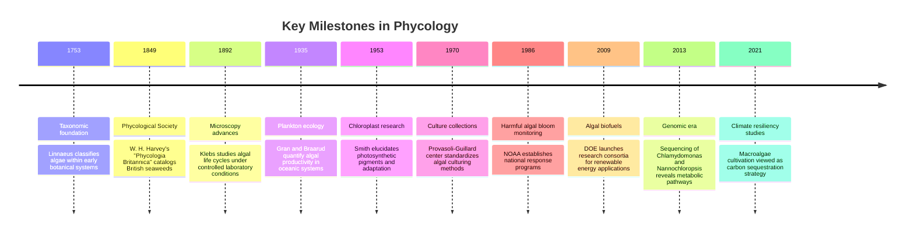

```mermaid
timeline
    title Key Milestones in Phycology
    1753 : Taxonomic foundation
          : Linnaeus classifies algae within early botanical systems
    1849 : Phycological Society
          : W. H. Harvey's "Phycologia Britannica" catalogs British seaweeds
    1892 : Microscopy advances
          : Klebs studies algal life cycles under controlled laboratory conditions
    1935 : Plankton ecology
          : Gran and Braarud quantify algal productivity in oceanic systems
    1953 : Chloroplast research
          : Smith elucidates photosynthetic pigments and adaptation
    1970 : Culture collections
          : Provasoli-Guillard center standardizes algal culturing methods
    1986 : Harmful algal bloom monitoring
          : NOAA establishes national response programs
    2009 : Algal biofuels
          : DOE launches research consortia for renewable energy applications
    2013 : Genomic era
          : Sequencing of Chlamydomonas and Nannochloropsis reveals metabolic pathways
    2021 : Climate resiliency studies
          : Macroalgae cultivation viewed as carbon sequestration strategy
```
