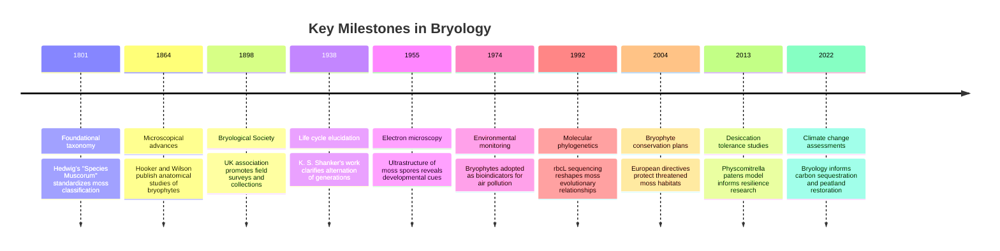

```mermaid
timeline
    title Key Milestones in Bryology
    1801 : Foundational taxonomy
          : Hedwig's "Species Muscorum" standardizes moss classification
    1864 : Microscopical advances
          : Hooker and Wilson publish anatomical studies of bryophytes
    1898 : Bryological Society
          : UK association promotes field surveys and collections
    1938 : Life cycle elucidation
          : K. S. Shanker's work clarifies alternation of generations
    1955 : Electron microscopy
          : Ultrastructure of moss spores reveals developmental cues
    1974 : Environmental monitoring
          : Bryophytes adopted as bioindicators for air pollution
    1992 : Molecular phylogenetics
          : rbcL sequencing reshapes moss evolutionary relationships
    2004 : Bryophyte conservation plans
          : European directives protect threatened moss habitats
    2013 : Desiccation tolerance studies
          : Physcomitrella patens model informs resilience research
    2022 : Climate change assessments
          : Bryology informs carbon sequestration and peatland restoration
```
