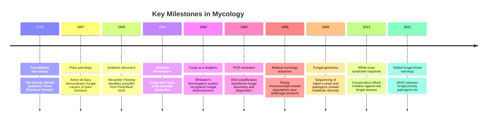

```mermaid
timeline
    title Key Milestones in Mycology
    1729 : Foundational microscopy
          : Pier Antonio Micheli publishes "Nova Plantarum Genera"
    1857 : Plant pathology
          : Anton de Bary demonstrates fungal causes of plant diseases
    1929 : Antibiotic discovery
          : Alexander Fleming identifies penicillin from Penicillium mold
    1941 : Industrial fermentation
          : Chain and Florey scale penicillin production
    1969 : Fungi as a kingdom
          : Whittaker's five-kingdom system recognizes fungal distinctiveness
    1983 : PCR revolution
          : DNA amplification transforms fungal taxonomy and diagnostics
    1998 : Medical mycology advances
          : Rising immunocompromised populations spur antifungal research
    2006 : Fungal genomics
          : Sequencing of baker's yeast and pathogens reveals metabolic diversity
    2013 : White-nose syndrome response
          : Conservation efforts mobilize against bat fungal disease
    2021 : Global fungal threat warnings
          : WHO releases fungal priority pathogens list
```
