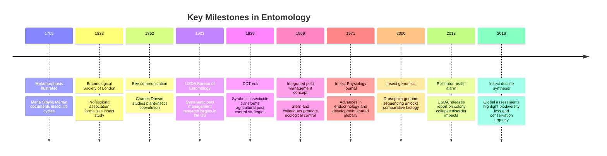

```mermaid
timeline
    title Key Milestones in Entomology
    1705 : Metamorphosis illustrated
          : Maria Sibylla Merian documents insect life cycles
    1833 : Entomological Society of London
          : Professional association formalizes insect study
    1862 : Bee communication
          : Charles Darwin studies plant-insect coevolution
    1903 : USDA Bureau of Entomology
          : Systematic pest management research begins in the US
    1939 : DDT era
          : Synthetic insecticide transforms agricultural pest control strategies
    1959 : Integrated pest management concept
          : Stern and colleagues promote ecological control
    1971 : Insect Physiology journal
          : Advances in endocrinology and development shared globally
    2000 : Insect genomics
          : Drosophila genome sequencing unlocks comparative biology
    2013 : Pollinator health alarm
          : USDA releases report on colony collapse disorder impacts
    2019 : Insect decline synthesis
          : Global assessments highlight biodiversity loss and conservation urgency
```
