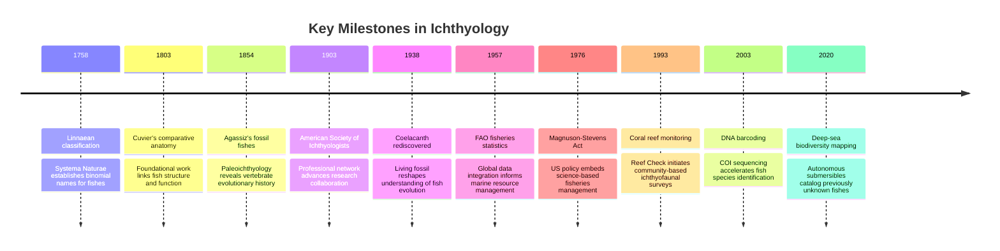

```mermaid
timeline
    title Key Milestones in Ichthyology
    1758 : Linnaean classification
          : Systema Naturae establishes binomial names for fishes
    1803 : Cuvier's comparative anatomy
          : Foundational work links fish structure and function
    1854 : Agassiz's fossil fishes
          : Paleoichthyology reveals vertebrate evolutionary history
    1903 : American Society of Ichthyologists
          : Professional network advances research collaboration
    1938 : Coelacanth rediscovered
          : Living fossil reshapes understanding of fish evolution
    1957 : FAO fisheries statistics
          : Global data integration informs marine resource management
    1976 : Magnuson-Stevens Act
          : US policy embeds science-based fisheries management
    1993 : Coral reef monitoring
          : Reef Check initiates community-based ichthyofaunal surveys
    2003 : DNA barcoding
          : COI sequencing accelerates fish species identification
    2020 : Deep-sea biodiversity mapping
          : Autonomous submersibles catalog previously unknown fishes
```
