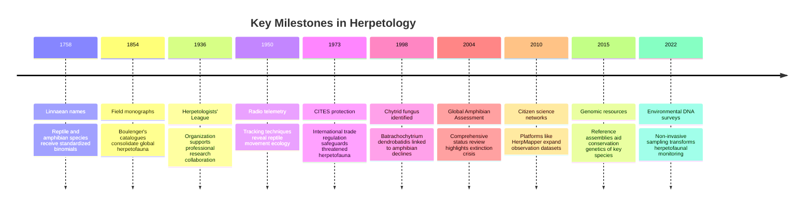

```mermaid
timeline
    title Key Milestones in Herpetology
    1758 : Linnaean names
          : Reptile and amphibian species receive standardized binomials
    1854 : Field monographs
          : Boulenger's catalogues consolidate global herpetofauna
    1936 : Herpetologists' League
          : Organization supports professional research collaboration
    1950 : Radio telemetry
          : Tracking techniques reveal reptile movement ecology
    1973 : CITES protection
          : International trade regulation safeguards threatened herpetofauna
    1998 : Chytrid fungus identified
          : Batrachochytrium dendrobatidis linked to amphibian declines
    2004 : Global Amphibian Assessment
          : Comprehensive status review highlights extinction crisis
    2010 : Citizen science networks
          : Platforms like HerpMapper expand observation datasets
    2015 : Genomic resources
          : Reference assemblies aid conservation genetics of key species
    2022 : Environmental DNA surveys
          : Non-invasive sampling transforms herpetofaunal monitoring
```
