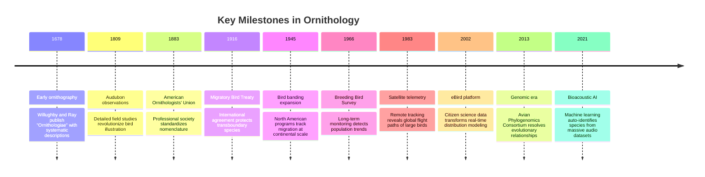

```mermaid
timeline
    title Key Milestones in Ornithology
    1678 : Early ornithography
          : Willughby and Ray publish "Ornithologiae" with systematic descriptions
    1809 : Audubon observations
          : Detailed field studies revolutionize bird illustration
    1883 : American Ornithologists' Union
          : Professional society standardizes nomenclature
    1916 : Migratory Bird Treaty
          : International agreement protects transboundary species
    1945 : Bird banding expansion
          : North American programs track migration at continental scale
    1966 : Breeding Bird Survey
          : Long-term monitoring detects population trends
    1983 : Satellite telemetry
          : Remote tracking reveals global flight paths of large birds
    2002 : eBird platform
          : Citizen science data transforms real-time distribution modeling
    2013 : Genomic era
          : Avian Phylogenomics Consortium resolves evolutionary relationships
    2021 : Bioacoustic AI
          : Machine learning auto-identifies species from massive audio datasets
```
