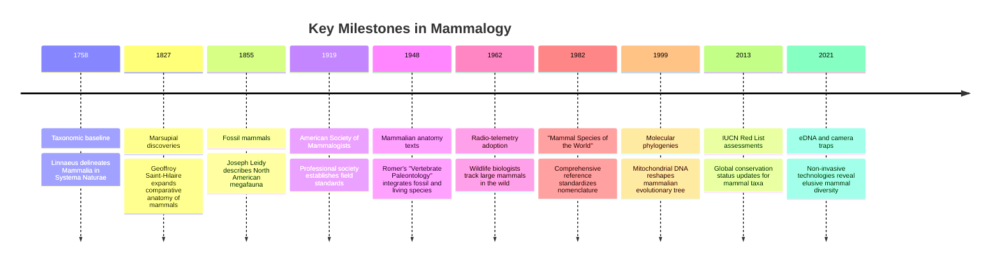

```mermaid
timeline
    title Key Milestones in Mammalogy
    1758 : Taxonomic baseline
          : Linnaeus delineates Mammalia in Systema Naturae
    1827 : Marsupial discoveries
          : Geoffroy Saint-Hilaire expands comparative anatomy of mammals
    1855 : Fossil mammals
          : Joseph Leidy describes North American megafauna
    1919 : American Society of Mammalogists
          : Professional society establishes field standards
    1948 : Mammalian anatomy texts
          : Romer's "Vertebrate Paleontology" integrates fossil and living species
    1962 : Radio-telemetry adoption
          : Wildlife biologists track large mammals in the wild
    1982 : "Mammal Species of the World"
          : Comprehensive reference standardizes nomenclature
    1999 : Molecular phylogenies
          : Mitochondrial DNA reshapes mammalian evolutionary tree
    2013 : IUCN Red List assessments
          : Global conservation status updates for mammal taxa
    2021 : eDNA and camera traps
          : Non-invasive technologies reveal elusive mammal diversity
```
