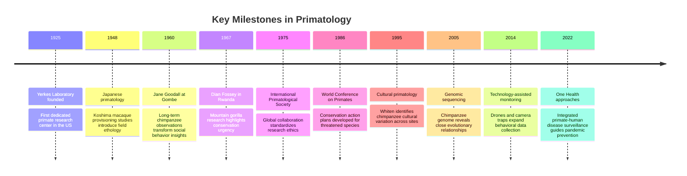

```mermaid
timeline
    title Key Milestones in Primatology
    1925 : Yerkes Laboratory founded
          : First dedicated primate research center in the US
    1948 : Japanese primatology
          : Koshima macaque provisioning studies introduce field ethology
    1960 : Jane Goodall at Gombe
          : Long-term chimpanzee observations transform social behavior insights
    1967 : Dian Fossey in Rwanda
          : Mountain gorilla research highlights conservation urgency
    1975 : International Primatological Society
          : Global collaboration standardizes research ethics
    1986 : World Conference on Primates
          : Conservation action plans developed for threatened species
    1995 : Cultural primatology
          : Whiten identifies chimpanzee cultural variation across sites
    2005 : Genomic sequencing
          : Chimpanzee genome reveals close evolutionary relationships
    2014 : Technology-assisted monitoring
          : Drones and camera traps expand behavioral data collection
    2022 : One Health approaches
          : Integrated primate-human disease surveillance guides pandemic prevention
```
