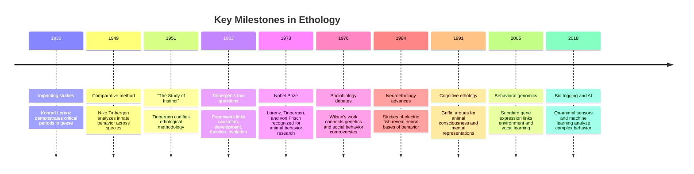

```mermaid
timeline
    title Key Milestones in Ethology
    1935 : Imprinting studies
          : Konrad Lorenz demonstrates critical periods in geese
    1949 : Comparative method
          : Niko Tinbergen analyzes innate behavior across species
    1951 : "The Study of Instinct"
          : Tinbergen codifies ethological methodology
    1963 : Tinbergen's four questions
          : Framework links causation, development, function, evolution
    1973 : Nobel Prize
          : Lorenz, Tinbergen, and von Frisch recognized for animal behavior research
    1976 : Sociobiology debates
          : Wilson's work connects genetics and social behavior controversies
    1984 : Neuroethology advances
          : Studies of electric fish reveal neural bases of behavior
    1991 : Cognitive ethology
          : Griffin argues for animal consciousness and mental representations
    2005 : Behavioral genomics
          : Songbird gene expression links environment and vocal learning
    2018 : Bio-logging and AI
          : On-animal sensors and machine learning analyze complex behavior
```
