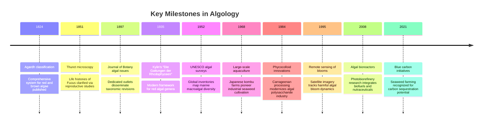

```mermaid
timeline
    title Key Milestones in Algology
    1824 : Agardh classification
          : Comprehensive system for red and brown algae published
    1851 : Thuret microscopy
          : Life histories of Fucus clarified via reproductive studies
    1897 : Journal of Botany algal issues
          : Dedicated outlets disseminate taxonomic revisions
    1935 : Kylin's "Die Gattungen der Rhodophyceen"
          : Modern framework for red algal genera
    1952 : UNESCO algal surveys
          : Global inventories map marine macroalgal diversity
    1968 : Large-scale aquaculture
          : Japanese kombu farms pioneer industrial seaweed cultivation
    1984 : Phycocolloid innovations
          : Carrageenan processing modernizes algal polysaccharide industry
    1995 : Remote sensing of blooms
          : Satellite imagery tracks harmful algal bloom dynamics
    2008 : Algal bioreactors
          : Photobiorefinery research integrates biofuels and nutraceuticals
    2021 : Blue carbon initiatives
          : Seaweed farming recognized for carbon sequestration potential
```
