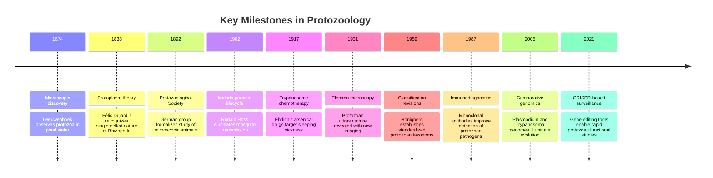

```mermaid
timeline
    title Key Milestones in Protozoology
    1674 : Microscopic discovery
          : Leeuwenhoek observes protozoa in pond water
    1838 : Protoplasm theory
          : Félix Dujardin recognizes single-celled nature of Rhizopoda
    1892 : Protozoological Society
          : German group formalizes study of microscopic animals
    1902 : Malaria parasite lifecycle
          : Ronald Ross elucidates mosquito transmission
    1917 : Trypanosome chemotherapy
          : Ehrlich's arsenical drugs target sleeping sickness
    1931 : Electron microscopy
          : Protozoan ultrastructure revealed with new imaging
    1959 : Classification revisions
          : Honigberg establishes standardized protozoan taxonomy
    1987 : Immunodiagnostics
          : Monoclonal antibodies improve detection of protozoan pathogens
    2005 : Comparative genomics
          : Plasmodium and Trypanosoma genomes illuminate evolution
    2021 : CRISPR-based surveillance
          : Gene editing tools enable rapid protozoan functional studies
```
