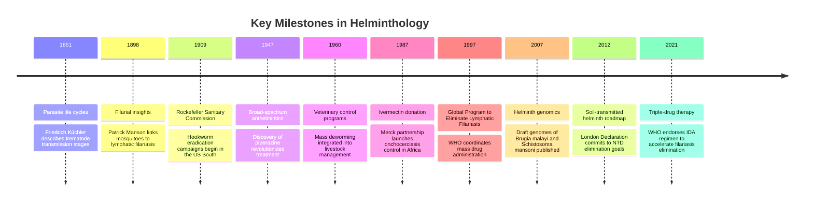

```mermaid
timeline
    title Key Milestones in Helminthology
    1851 : Parasite life cycles
          : Friedrich Küchler describes trematode transmission stages
    1898 : Filarial insights
          : Patrick Manson links mosquitoes to lymphatic filariasis
    1909 : Rockefeller Sanitary Commission
          : Hookworm eradication campaigns begin in the US South
    1947 : Broad-spectrum anthelmintics
          : Discovery of piperazine revolutionizes treatment
    1960 : Veterinary control programs
          : Mass deworming integrated into livestock management
    1987 : Ivermectin donation
          : Merck partnership launches onchocerciasis control in Africa
    1997 : Global Program to Eliminate Lymphatic Filariasis
          : WHO coordinates mass drug administration
    2007 : Helminth genomics
          : Draft genomes of Brugia malayi and Schistosoma mansoni published
    2012 : Soil-transmitted helminth roadmap
          : London Declaration commits to NTD elimination goals
    2021 : Triple-drug therapy
          : WHO endorses IDA regimen to accelerate filariasis elimination
```
