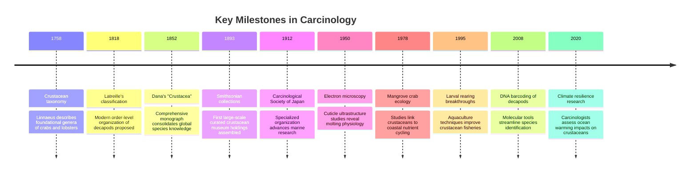

```mermaid
timeline
    title Key Milestones in Carcinology
    1758 : Crustacean taxonomy
          : Linnaeus describes foundational genera of crabs and lobsters
    1818 : Latreille's classification
          : Modern order-level organization of decapods proposed
    1852 : Dana's "Crustacea"
          : Comprehensive monograph consolidates global species knowledge
    1893 : Smithsonian collections
          : First large-scale curated crustacean museum holdings assembled
    1912 : Carcinological Society of Japan
          : Specialized organization advances marine research
    1950 : Electron microscopy
          : Cuticle ultrastructure studies reveal molting physiology
    1978 : Mangrove crab ecology
          : Studies link crustaceans to coastal nutrient cycling
    1995 : Larval rearing breakthroughs
          : Aquaculture techniques improve crustacean fisheries
    2008 : DNA barcoding of decapods
          : Molecular tools streamline species identification
    2020 : Climate resilience research
          : Carcinologists assess ocean warming impacts on crustaceans
```
