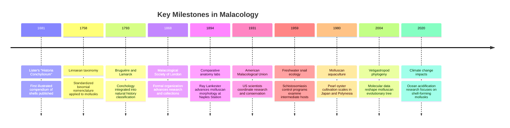

```mermaid
timeline
    title Key Milestones in Malacology
    1681 : Lister's "Historia Conchyliorum"
          : First illustrated compendium of shells published
    1758 : Linnaean taxonomy
          : Standardized binomial nomenclature applied to mollusks
    1793 : Bruguière and Lamarck
          : Conchology integrated into natural history classification
    1868 : Malacological Society of London
          : Formal organization advances research and collections
    1894 : Comparative anatomy labs
          : Ray Lankester advances molluscan morphology at Naples Station
    1931 : American Malacological Union
          : US scientists coordinate research and conservation
    1959 : Freshwater snail ecology
          : Schistosomiasis control programs examine intermediate hosts
    1980 : Molluscan aquaculture
          : Pearl oyster cultivation scales in Japan and Polynesia
    2004 : Vetigastropod phylogeny
          : Molecular data reshape molluscan evolutionary tree
    2020 : Climate change impacts
          : Ocean acidification research focuses on shell-forming mollusks
```
