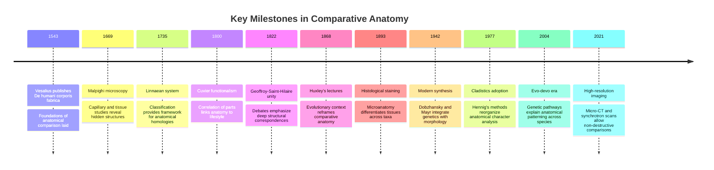

```mermaid
timeline
    title Key Milestones in Comparative Anatomy
    1543 : Vesalius publishes De humani corporis fabrica
          : Foundations of anatomical comparison laid
    1669 : Malpighi microscopy
          : Capillary and tissue studies reveal hidden structures
    1735 : Linnaean system
          : Classification provides framework for anatomical homologies
    1800 : Cuvier functionalism
          : Correlation of parts links anatomy to lifestyle
    1822 : Geoffroy-Saint-Hilaire unity
          : Debates emphasize deep structural correspondences
    1868 : Huxley's lectures
          : Evolutionary context reframes comparative anatomy
    1893 : Histological staining
          : Microanatomy differentiates tissues across taxa
    1942 : Modern synthesis
          : Dobzhansky and Mayr integrate genetics with morphology
    1977 : Cladistics adoption
          : Hennig's methods reorganize anatomical character analysis
    2004 : Evo-devo era
          : Genetic pathways explain anatomical patterning across species
    2021 : High-resolution imaging
          : Micro-CT and synchrotron scans allow non-destructive comparisons
```
