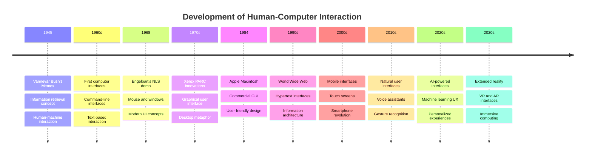

```mermaid
timeline
    title Development of Human-Computer Interaction
    1945 : Vannevar Bush's Memex
          : Information retrieval concept
          : Human-machine interaction
    1960s : First computer interfaces
          : Command-line interfaces
          : Text-based interaction
    1968 : Engelbart's NLS demo
          : Mouse and windows
          : Modern UI concepts
    1970s : Xerox PARC innovations
          : Graphical user interface
          : Desktop metaphor
    1984 : Apple Macintosh
          : Commercial GUI
          : User-friendly design
    1990s : World Wide Web
          : Hypertext interfaces
          : Information architecture
    2000s : Mobile interfaces
          : Touch screens
          : Smartphone revolution
    2010s : Natural user interfaces
          : Voice assistants
          : Gesture recognition
    2020s : AI-powered interfaces
          : Machine learning UX
          : Personalized experiences
    2020s : Extended reality
          : VR and AR interfaces
          : Immersive computing
```
