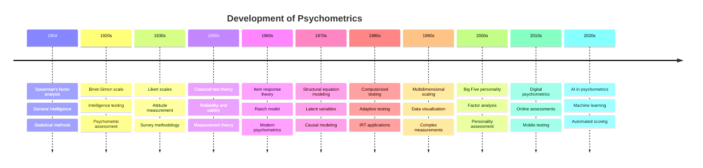

```mermaid
timeline
    title Development of Psychometrics
    1904 : Spearman's factor analysis
          : General intelligence
          : Statistical methods
    1920s : Binet-Simon scale
          : Intelligence testing
          : Psychometric assessment
    1930s : Likert scales
          : Attitude measurement
          : Survey methodology
    1950s : Classical test theory
          : Reliability and validity
          : Measurement theory
    1960s : Item response theory
          : Rasch model
          : Modern psychometrics
    1970s : Structural equation modeling
          : Latent variables
          : Causal modeling
    1980s : Computerized testing
          : Adaptive testing
          : IRT applications
    1990s : Multidimensional scaling
          : Data visualization
          : Complex measurements
    2000s : Big Five personality
          : Factor analysis
          : Personality assessment
    2010s : Digital psychometrics
          : Online assessments
          : Mobile testing
    2020s : AI in psychometrics
          : Machine learning
          : Automated scoring
```
