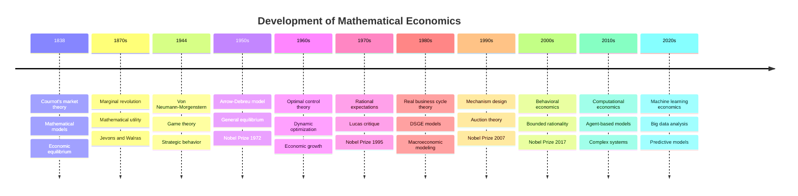

```mermaid
timeline
    title Development of Mathematical Economics
    1838 : Cournot's market theory
          : Mathematical models
          : Economic equilibrium
    1870s : Marginal revolution
          : Mathematical utility
          : Jevons and Walras
    1944 : Von Neumann-Morgenstern
          : Game theory
          : Strategic behavior
    1950s : Arrow-Debreu model
          : General equilibrium
          : Nobel Prize 1972
    1960s : Optimal control theory
          : Dynamic optimization
          : Economic growth
    1970s : Rational expectations
          : Lucas critique
          : Nobel Prize 1995
    1980s : Real business cycle theory
          : DSGE models
          : Macroeconomic modeling
    1990s : Mechanism design
          : Auction theory
          : Nobel Prize 2007
    2000s : Behavioral economics
          : Bounded rationality
          : Nobel Prize 2017
    2010s : Computational economics
          : Agent-based models
          : Complex systems
    2020s : Machine learning economics
          : Big data analysis
          : Predictive models
```
