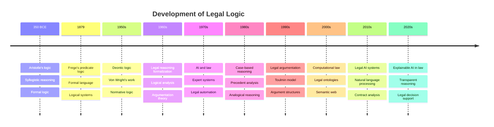

```mermaid
timeline
    title Development of Legal Logic
    350 BCE : Aristotle's logic
          : Syllogistic reasoning
          : Formal logic
    1879 : Frege's predicate logic
          : Formal language
          : Logical systems
    1950s : Deontic logic
          : Von Wright's work
          : Normative logic
    1960s : Legal reasoning formalization
          : Logical analysis
          : Argumentation theory
    1970s : AI and law
          : Expert systems
          : Legal automation
    1980s : Case-based reasoning
          : Precedent analysis
          : Analogical reasoning
    1990s : Legal argumentation
          : Toulmin model
          : Argument structures
    2000s : Computational law
          : Legal ontologies
          : Semantic web
    2010s : Legal AI systems
          : Natural language processing
          : Contract analysis
    2020s : Explainable AI in law
          : Transparent reasoning
          : Legal decision support
```
