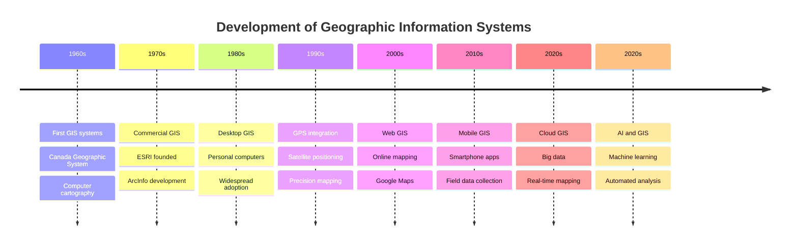

```mermaid
timeline
    title Development of Geographic Information Systems
    1960s : First GIS systems
          : Canada Geographic System
          : Computer cartography
    1970s : Commercial GIS
          : ESRI founded
          : ArcInfo development
    1980s : Desktop GIS
          : Personal computers
          : Widespread adoption
    1990s : GPS integration
          : Satellite positioning
          : Precision mapping
    2000s : Web GIS
          : Online mapping
          : Google Maps
    2010s : Mobile GIS
          : Smartphone apps
          : Field data collection
    2020s : Cloud GIS
          : Big data
          : Real-time mapping
    2020s : AI and GIS
          : Machine learning
          : Automated analysis
```
