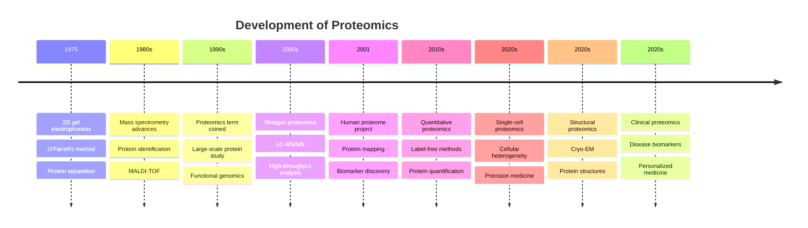

```mermaid
timeline
    title Development of Proteomics
    1975 : 2D gel electrophoresis
          : O'Farrell's method
          : Protein separation
    1980s : Mass spectrometry advances
          : Protein identification
          : MALDI-TOF
    1990s : Proteomics term coined
          : Large-scale protein study
          : Functional genomics
    2000s : Shotgun proteomics
          : LC-MS/MS
          : High-throughput analysis
    2001 : Human proteome project
          : Protein mapping
          : Biomarker discovery
    2010s : Quantitative proteomics
          : Label-free methods
          : Protein quantification
    2020s : Single-cell proteomics
          : Cellular heterogeneity
          : Precision medicine
    2020s : Structural proteomics
          : Cryo-EM
          : Protein structures
    2020s : Clinical proteomics
          : Disease biomarkers
          : Personalized medicine
```
