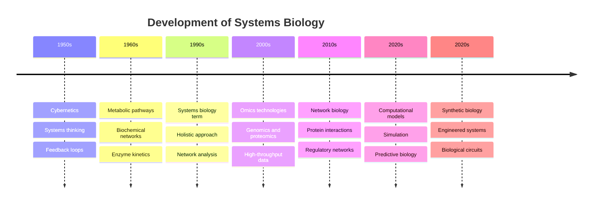

```mermaid
timeline
    title Development of Systems Biology
    1950s : Cybernetics
          : Systems thinking
          : Feedback loops
    1960s : Metabolic pathways
          : Biochemical networks
          : Enzyme kinetics
    1990s : Systems biology term
          : Holistic approach
          : Network analysis
    2000s : Omics technologies
          : Genomics and proteomics
          : High-throughput data
    2010s : Network biology
          : Protein interactions
          : Regulatory networks
    2020s : Computational models
          : Simulation
          : Predictive biology
    2020s : Synthetic biology
          : Engineered systems
          : Biological circuits
```
