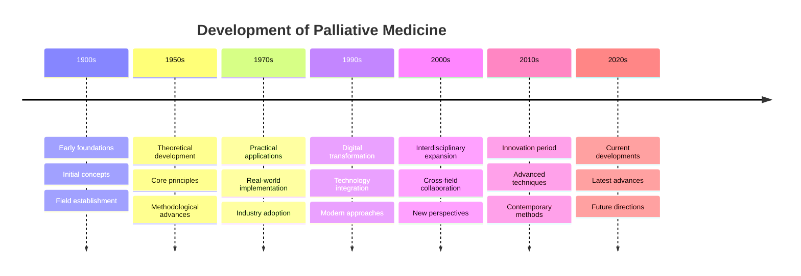

```mermaid
timeline
    title Development of Palliative Medicine
    1900s : Early foundations
          : Initial concepts
          : Field establishment
    1950s : Theoretical development
          : Core principles
          : Methodological advances
    1970s : Practical applications
          : Real-world implementation
          : Industry adoption
    1990s : Digital transformation
          : Technology integration
          : Modern approaches
    2000s : Interdisciplinary expansion
          : Cross-field collaboration
          : New perspectives
    2010s : Innovation period
          : Advanced techniques
          : Contemporary methods
    2020s : Current developments
          : Latest advances
          : Future directions
```
