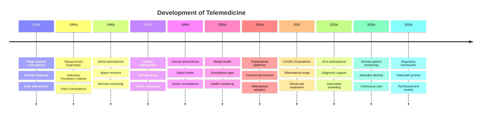

```mermaid
timeline
    title Development of Telemedicine
    1920s : Radio medical consultations
          : Remote diagnosis
          : Early telemedicine
    1950s : Telepsychiatry beginnings
          : Nebraska Psychiatric Institute
          : Video consultations
    1960s : NASA telemedicine
          : Space missions
          : Remote monitoring
    1970s : Satellite telemedicine
          : Remote areas
          : Global connectivity
    1990s : Internet telemedicine
          : Digital health
          : Online consultations
    2000s : Mobile health
          : Smartphone apps
          : Health monitoring
    2010s : Telemedicine platforms
          : Commercial services
          : Widespread adoption
    2020 : COVID-19 pandemic
          : Telemedicine surge
          : Virtual care expansion
    2020s : AI in telemedicine
          : Diagnostic support
          : Automated screening
    2020s : Remote patient monitoring
          : Wearable devices
          : Continuous care
    2020s : Regulatory frameworks
          : Telehealth policies
          : Reimbursement models
```
