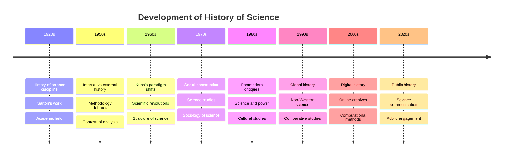

```mermaid
timeline
    title Development of History of Science
    1920s : History of science discipline
          : Sarton's work
          : Academic field
    1950s : Internal vs external history
          : Methodology debates
          : Contextual analysis
    1960s : Kuhn's paradigm shifts
          : Scientific revolutions
          : Structure of science
    1970s : Social construction
          : Science studies
          : Sociology of science
    1980s : Postmodern critiques
          : Science and power
          : Cultural studies
    1990s : Global history
          : Non-Western science
          : Comparative studies
    2000s : Digital history
          : Online archives
          : Computational methods
    2020s : Public history
          : Science communication
          : Public engagement
```
