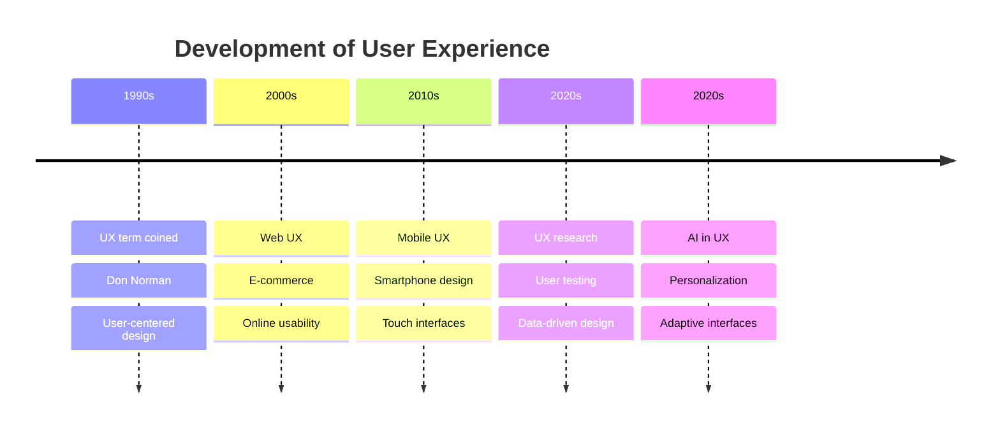

```mermaid
timeline
    title Development of User Experience
    1990s : UX term coined
          : Don Norman
          : User-centered design
    2000s : Web UX
          : E-commerce
          : Online usability
    2010s : Mobile UX
          : Smartphone design
          : Touch interfaces
    2020s : UX research
          : User testing
          : Data-driven design
    2020s : AI in UX
          : Personalization
          : Adaptive interfaces
```
