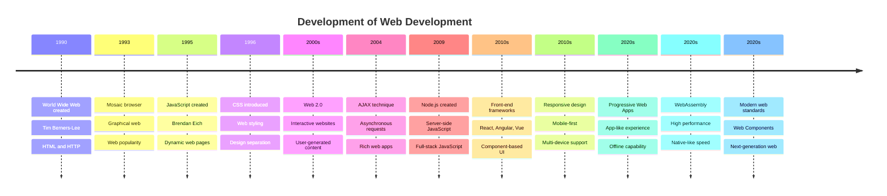

```mermaid
timeline
    title Development of Web Development
    1990 : World Wide Web created
          : Tim Berners-Lee
          : HTML and HTTP
    1993 : Mosaic browser
          : Graphical web
          : Web popularity
    1995 : JavaScript created
          : Brendan Eich
          : Dynamic web pages
    1996 : CSS introduced
          : Web styling
          : Design separation
    2000s : Web 2.0
          : Interactive websites
          : User-generated content
    2004 : AJAX technique
          : Asynchronous requests
          : Rich web apps
    2009 : Node.js created
          : Server-side JavaScript
          : Full-stack JavaScript
    2010s : Front-end frameworks
          : React, Angular, Vue
          : Component-based UI
    2010s : Responsive design
          : Mobile-first
          : Multi-device support
    2020s : Progressive Web Apps
          : App-like experience
          : Offline capability
    2020s : WebAssembly
          : High performance
          : Native-like speed
    2020s : Modern web standards
          : Web Components
          : Next-generation web
```
