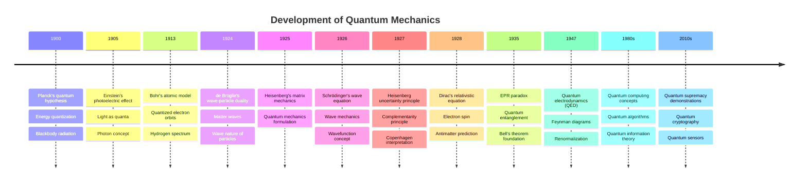

```mermaid
timeline
    title Development of Quantum Mechanics
    1900 : Planck's quantum hypothesis
          : Energy quantization
          : Blackbody radiation
    1905 : Einstein's photoelectric effect
          : Light as quanta
          : Photon concept
    1913 : Bohr's atomic model
          : Quantized electron orbits
          : Hydrogen spectrum
    1924 : de Broglie's wave-particle duality
          : Matter waves
          : Wave nature of particles
    1925 : Heisenberg's matrix mechanics
          : Quantum mechanics formulation
    1926 : Schrödinger's wave equation
          : Wave mechanics
          : Wavefunction concept
    1927 : Heisenberg uncertainty principle
          : Complementarity principle
          : Copenhagen interpretation
    1928 : Dirac's relativistic equation
          : Electron spin
          : Antimatter prediction
    1935 : EPR paradox
          : Quantum entanglement
          : Bell's theorem foundation
    1947 : Quantum electrodynamics (QED)
          : Feynman diagrams
          : Renormalization
    1980s : Quantum computing concepts
          : Quantum algorithms
          : Quantum information theory
    2010s : Quantum supremacy demonstrations
          : Quantum cryptography
          : Quantum sensors
```
