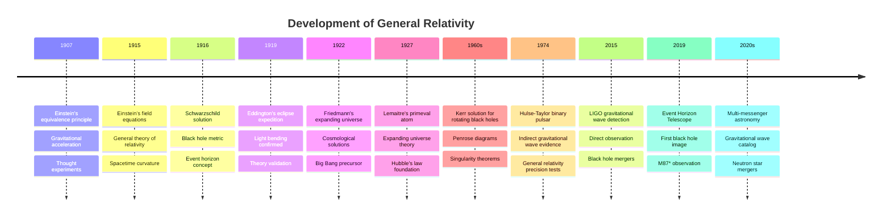

```mermaid
timeline
    title Development of General Relativity
    1907 : Einstein's equivalence principle
          : Gravitational acceleration
          : Thought experiments
    1915 : Einstein's field equations
          : General theory of relativity
          : Spacetime curvature
    1916 : Schwarzschild solution
          : Black hole metric
          : Event horizon concept
    1919 : Eddington's eclipse expedition
          : Light bending confirmed
          : Theory validation
    1922 : Friedmann's expanding universe
          : Cosmological solutions
          : Big Bang precursor
    1927 : Lemaitre's primeval atom
          : Expanding universe theory
          : Hubble's law foundation
    1960s : Kerr solution for rotating black holes
          : Penrose diagrams
          : Singularity theorems
    1974 : Hulse-Taylor binary pulsar
          : Indirect gravitational wave evidence
          : General relativity precision tests
    2015 : LIGO gravitational wave detection
          : Direct observation
          : Black hole mergers
    2019 : Event Horizon Telescope
          : First black hole image
          : M87* observation
    2020s : Multi-messenger astronomy
          : Gravitational wave catalog
          : Neutron star mergers
```
