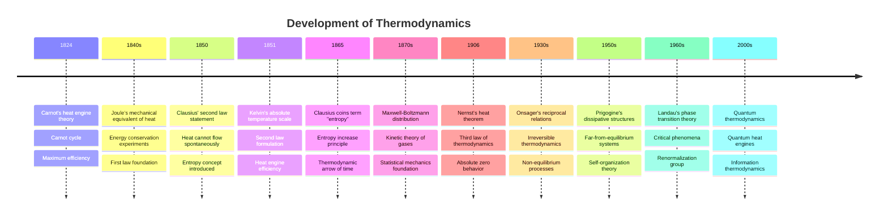

```mermaid
timeline
    title Development of Thermodynamics
    1824 : Carnot's heat engine theory
          : Carnot cycle
          : Maximum efficiency
    1840s : Joule's mechanical equivalent of heat
          : Energy conservation experiments
          : First law foundation
    1850 : Clausius' second law statement
          : Heat cannot flow spontaneously
          : Entropy concept introduced
    1851 : Kelvin's absolute temperature scale
          : Second law formulation
          : Heat engine efficiency
    1865 : Clausius coins term "entropy"
          : Entropy increase principle
          : Thermodynamic arrow of time
    1870s : Maxwell-Boltzmann distribution
          : Kinetic theory of gases
          : Statistical mechanics foundation
    1906 : Nernst's heat theorem
          : Third law of thermodynamics
          : Absolute zero behavior
    1930s : Onsager's reciprocal relations
          : Irreversible thermodynamics
          : Non-equilibrium processes
    1950s : Prigogine's dissipative structures
          : Far-from-equilibrium systems
          : Self-organization theory
    1960s : Landau's phase transition theory
          : Critical phenomena
          : Renormalization group
    2000s : Quantum thermodynamics
          : Quantum heat engines
          : Information thermodynamics
```
