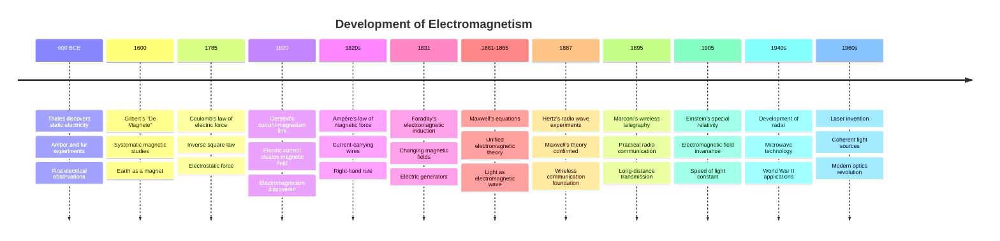

```mermaid
timeline
    title Development of Electromagnetism
    600 BCE : Thales discovers static electricity
          : Amber and fur experiments
          : First electrical observations
    1600 : Gilbert's "De Magnete"
          : Systematic magnetic studies
          : Earth as a magnet
    1785 : Coulomb's law of electric force
          : Inverse square law
          : Electrostatic force
    1820 : Oersted's current-magnetism link
          : Electric current creates magnetic field
          : Electromagnetism discovered
    1820s : Ampère's law of magnetic force
          : Current-carrying wires
          : Right-hand rule
    1831 : Faraday's electromagnetic induction
          : Changing magnetic fields
          : Electric generators
    1861-1865 : Maxwell's equations
          : Unified electromagnetic theory
          : Light as electromagnetic wave
    1887 : Hertz's radio wave experiments
          : Maxwell's theory confirmed
          : Wireless communication foundation
    1895 : Marconi's wireless telegraphy
          : Practical radio communication
          : Long-distance transmission
    1905 : Einstein's special relativity
          : Electromagnetic field invariance
          : Speed of light constant
    1940s : Development of radar
          : Microwave technology
          : World War II applications
    1960s : Laser invention
          : Coherent light sources
          : Modern optics revolution
```
