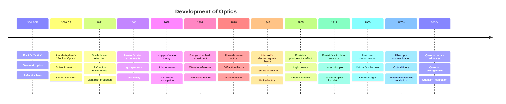

```mermaid
timeline
    title Development of Optics
    300 BCE : Euclid's "Optics"
          : Geometric optics
          : Reflection laws
    1000 CE : Ibn al-Haytham's "Book of Optics"
          : Scientific method
          : Camera obscura
    1621 : Snell's law of refraction
          : Refraction mathematics
          : Light path prediction
    1665 : Newton's prism experiments
          : Light spectrum
          : Color theory
    1678 : Huygens' wave theory
          : Light as waves
          : Wavefront propagation
    1801 : Young's double-slit experiment
          : Wave interference
          : Light wave nature
    1818 : Fresnel's wave optics
          : Diffraction theory
          : Wave equation
    1865 : Maxwell's electromagnetic theory
          : Light as EM wave
          : Unified optics
    1905 : Einstein's photoelectric effect
          : Light quanta
          : Photon concept
    1917 : Einstein's stimulated emission
          : Laser principle
          : Quantum optics foundation
    1960 : First laser demonstration
          : Maiman's ruby laser
          : Coherent light
    1970s : Fiber optic communication
          : Optical fibers
          : Telecommunications revolution
    2000s : Quantum optics advances
          : Quantum entanglement
          : Quantum information
```
