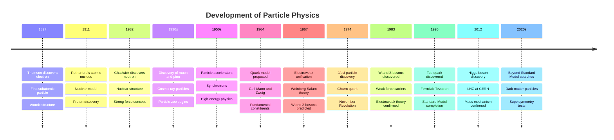

```mermaid
timeline
    title Development of Particle Physics
    1897 : Thomson discovers electron
          : First subatomic particle
          : Atomic structure
    1911 : Rutherford's atomic nucleus
          : Nuclear model
          : Proton discovery
    1932 : Chadwick discovers neutron
          : Nuclear structure
          : Strong force concept
    1930s : Discovery of muon and pion
          : Cosmic ray particles
          : Particle zoo begins
    1950s : Particle accelerators
          : Synchrotrons
          : High-energy physics
    1964 : Quark model proposed
          : Gell-Mann and Zweig
          : Fundamental constituents
    1967 : Electroweak unification
          : Weinberg-Salam theory
          : W and Z bosons predicted
    1974 : J/psi particle discovery
          : Charm quark
          : November Revolution
    1983 : W and Z bosons discovered
          : Weak force carriers
          : Electroweak theory confirmed
    1995 : Top quark discovered
          : Fermilab Tevatron
          : Standard Model completion
    2012 : Higgs boson discovery
          : LHC at CERN
          : Mass mechanism confirmed
    2020s : Beyond Standard Model searches
          : Dark matter particles
          : Supersymmetry tests
```
