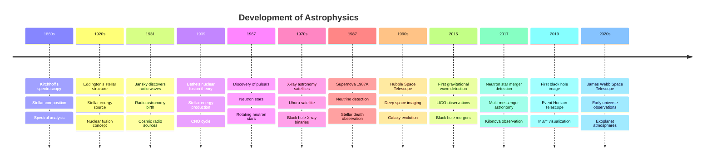

```mermaid
timeline
    title Development of Astrophysics
    1860s : Kirchhoff's spectroscopy
          : Stellar composition
          : Spectral analysis
    1920s : Eddington's stellar structure
          : Stellar energy source
          : Nuclear fusion concept
    1931 : Jansky discovers radio waves
          : Radio astronomy birth
          : Cosmic radio sources
    1939 : Bethe's nuclear fusion theory
          : Stellar energy production
          : CNO cycle
    1967 : Discovery of pulsars
          : Neutron stars
          : Rotating neutron stars
    1970s : X-ray astronomy satellites
          : Uhuru satellite
          : Black hole X-ray binaries
    1987 : Supernova 1987A
          : Neutrino detection
          : Stellar death observation
    1990s : Hubble Space Telescope
          : Deep space imaging
          : Galaxy evolution
    2015 : First gravitational wave detection
          : LIGO observations
          : Black hole mergers
    2017 : Neutron star merger detection
          : Multi-messenger astronomy
          : Kilonova observation
    2019 : First black hole image
          : Event Horizon Telescope
          : M87* visualization
    2020s : James Webb Space Telescope
          : Early universe observations
          : Exoplanet atmospheres
```
