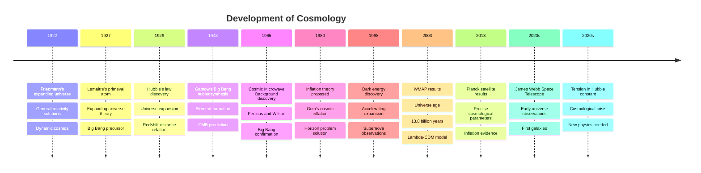

```mermaid
timeline
    title Development of Cosmology
    1922 : Friedmann's expanding universe
          : General relativity solutions
          : Dynamic cosmos
    1927 : Lemaitre's primeval atom
          : Expanding universe theory
          : Big Bang precursor
    1929 : Hubble's law discovery
          : Universe expansion
          : Redshift-distance relation
    1948 : Gamow's Big Bang nucleosynthesis
          : Element formation
          : CMB prediction
    1965 : Cosmic Microwave Background discovery
          : Penzias and Wilson
          : Big Bang confirmation
    1980 : Inflation theory proposed
          : Guth's cosmic inflation
          : Horizon problem solution
    1998 : Dark energy discovery
          : Accelerating expansion
          : Supernova observations
    2003 : WMAP results
          : Universe age: 13.8 billion years
          : Lambda-CDM model
    2013 : Planck satellite results
          : Precise cosmological parameters
          : Inflation evidence
    2020s : James Webb Space Telescope
          : Early universe observations
          : First galaxies
    2020s : Tension in Hubble constant
          : Cosmological crisis
          : New physics needed
```
