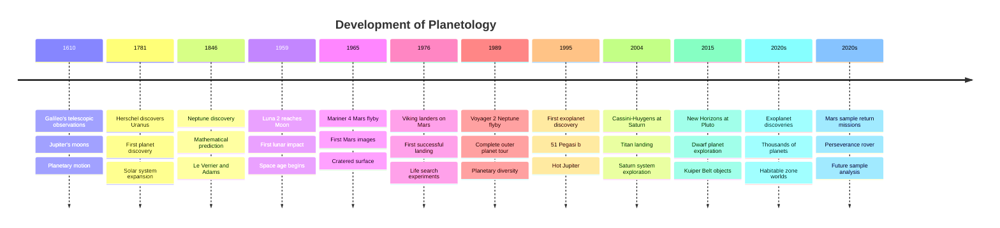

```mermaid
timeline
    title Development of Planetology
    1610 : Galileo's telescopic observations
          : Jupiter's moons
          : Planetary motion
    1781 : Herschel discovers Uranus
          : First planet discovery
          : Solar system expansion
    1846 : Neptune discovery
          : Mathematical prediction
          : Le Verrier and Adams
    1959 : Luna 2 reaches Moon
          : First lunar impact
          : Space age begins
    1965 : Mariner 4 Mars flyby
          : First Mars images
          : Cratered surface
    1976 : Viking landers on Mars
          : First successful landing
          : Life search experiments
    1989 : Voyager 2 Neptune flyby
          : Complete outer planet tour
          : Planetary diversity
    1995 : First exoplanet discovery
          : 51 Pegasi b
          : Hot Jupiter
    2004 : Cassini-Huygens at Saturn
          : Titan landing
          : Saturn system exploration
    2015 : New Horizons at Pluto
          : Dwarf planet exploration
          : Kuiper Belt objects
    2020s : Exoplanet discoveries
          : Thousands of planets
          : Habitable zone worlds
    2020s : Mars sample return missions
          : Perseverance rover
          : Future sample analysis
```
