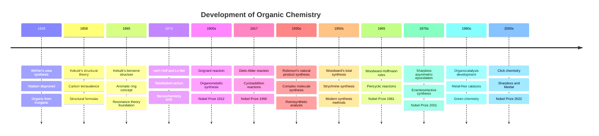

```mermaid
timeline
    title Development of Organic Chemistry
    1828 : Wöhler's urea synthesis
          : Vitalism disproved
          : Organic from inorganic
    1858 : Kekulé's structural theory
          : Carbon tetravalence
          : Structural formulas
    1865 : Kekulé's benzene structure
          : Aromatic ring concept
          : Resonance theory foundation
    1874 : van't Hoff and Le Bel
          : Tetrahedral carbon
          : Stereochemistry birth
    1900s : Grignard reaction
          : Organometallic synthesis
          : Nobel Prize 1912
    1917 : Diels-Alder reaction
          : Cycloaddition reactions
          : Nobel Prize 1950
    1930s : Robinson's natural product synthesis
          : Complex molecule synthesis
          : Retrosynthetic analysis
    1950s : Woodward's total synthesis
          : Strychnine synthesis
          : Modern synthesis methods
    1965 : Woodward-Hoffmann rules
          : Pericyclic reactions
          : Nobel Prize 1981
    1970s : Sharpless asymmetric epoxidation
          : Enantioselective synthesis
          : Nobel Prize 2001
    1980s : Organocatalysis development
          : Metal-free catalysis
          : Green chemistry
    2000s : Click chemistry
          : Sharpless and Meldal
          : Nobel Prize 2022
```
