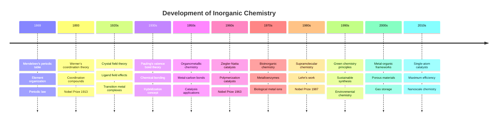

```mermaid
timeline
    title Development of Inorganic Chemistry
    1869 : Mendeleev's periodic table
          : Element organization
          : Periodic law
    1893 : Werner's coordination theory
          : Coordination compounds
          : Nobel Prize 1913
    1920s : Crystal field theory
          : Ligand field effects
          : Transition metal complexes
    1930s : Pauling's valence bond theory
          : Chemical bonding
          : Hybridization concept
    1950s : Organometallic chemistry
          : Metal-carbon bonds
          : Catalysis applications
    1960s : Ziegler-Natta catalysis
          : Polymerization catalysts
          : Nobel Prize 1963
    1970s : Bioinorganic chemistry
          : Metalloenzymes
          : Biological metal ions
    1980s : Supramolecular chemistry
          : Lehn's work
          : Nobel Prize 1987
    1990s : Green chemistry principles
          : Sustainable synthesis
          : Environmental chemistry
    2000s : Metal-organic frameworks
          : Porous materials
          : Gas storage
    2010s : Single-atom catalysts
          : Maximum efficiency
          : Nanoscale chemistry
```
